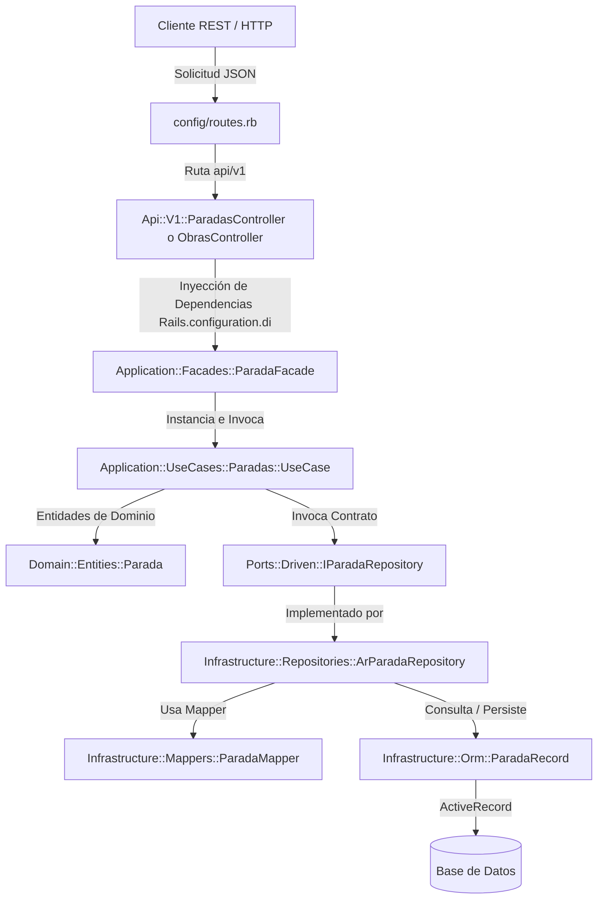

# Diseño Técnico: Registrar Paradas (registrar-paradas)

Este documento detalla el diseño técnico y la arquitectura del cambio `registrar-paradas` en el proyecto `g3-marcaya`. Se adopta una arquitectura hexagonal (Clean/Ports and Adapters) sobre Ruby on Rails 8.1.

---

## 1. Decisiones Arquitectónicas y Estructura Hexagonal

El sistema separa las responsabilidades en capas bien definidas para asegurar un diseño desacoplado, testeable y mantenible:

- **Dominio (Domain)**: Contiene las entidades puras de negocio (`Parada`, `EmpleadoParada`) y las excepciones de dominio. No depende de ningún framework ni de la base de datos (ActiveRecord).
- **Puertos (Ports)**: Interfaces que actúan como contratos.
  - **Driving Ports (IGestionarParada)**: Define qué acciones puede realizar la aplicación sobre el dominio.
  - **Driven Ports (IParadaRepository, IEmpleadoParadaRepository)**: Define los métodos necesarios para persistir/recuperar datos del dominio.
- **Aplicación (Application - Use Cases y Facades)**: Implementa los casos de uso específicos.
  - La fachada `ParadaFacade` unifica el punto de entrada y expone los métodos que implementan la interfaz `IGestionarParada`.
- **Infraestructura (Infrastructure)**: Implementaciones concretas basadas en el framework.
  - **ORM (Orm Records)**: Modelos de ActiveRecord (`ParadaRecord`, `EmpleadoParadaRecord`) encargados de la interacción directa con Postgres/SQLite.
  - **Mappers**: Traductores que convierten registros ORM a entidades de dominio y viceversa.
  - **Repositories**: Implementaciones de los puertos driven (`ArParadaRepository`, `ArEmpleadoParadaRepository`) que delegan en ActiveRecord y usan los mappers.
- **Controladores / Rutas (Presentation/API)**: Controladores REST que exponen los endpoints públicos del sistema. Usan los Serializers para formatear las respuestas.

### Diagrama de Flujo de Datos



---

## 2. Cambios en la Base de Datos (Esquema y Migraciones)

Se crearán dos tablas físicas: `paradas` y `empleado_paradas`.

### Tabla: `paradas`
- `id` (bigint, llave primaria auto-incremental).
- `obra_id` (bigint, no nulo, llave foránea a `obras(id)` con `ON DELETE CASCADE`).
- `nombre` (string/varchar de 150 caracteres, no nulo, único por obra).
- `latitud` (float/decimal, no nulo, rango [-90.0, 90.0]).
- `longitud` (float/decimal, no nulo, rango [-180.0, 180.0]).
- `radio_metros` (integer, no nulo, por defecto 50, valor > 0).
- `estado` (string/varchar de 20 caracteres, no nulo, por defecto 'activa', valores permitidos: 'activa', 'inactiva').
- `created_at` / `updated_at` (timestamps).

### Tabla: `empleado_paradas`
- `id` (bigint, llave primaria auto-incremental).
- `empleado_id` (bigint, no nulo, llave foránea a `empleados(id)` con `ON DELETE CASCADE`).
- `parada_id` (bigint, no nulo, llave foránea a `paradas(id)` con `ON DELETE CASCADE`).
- `activo` (boolean, no nulo, por defecto true).
- `estado` (string/varchar de 20 caracteres, no nulo, por defecto 'activo').
- `created_at` / `updated_at` (timestamps).
- Índice único en `(empleado_id, parada_id)` para evitar asignaciones duplicadas.

### Migraciones propuestas (Rails)

```ruby
# db/migrate/XXXXXXXXXXXXXX_create_paradas.rb
class CreateParadas < ActiveRecord::Migration[8.1]
  def change
    create_table :paradas do |t|
      t.bigint :obra_id, null: false
      t.string :nombre, limit: 150, null: false
      t.float :latitud, null: false
      t.float :longitud, null: false
      t.integer :radio_metros, null: false, default: 50
      t.string :estado, limit: 20, null: false, default: "activa"

      t.timestamps
    end

    add_foreign_key :paradas, :obras, name: "paradas_obra_id_fkey", on_delete: :cascade
    add_index :paradas, [:obra_id, :nombre], unique: true
  end
end

# db/migrate/XXXXXXXXXXXXXX_create_empleado_paradas.rb
class CreateEmpleadoParadas < ActiveRecord::Migration[8.1]
  def change
    create_table :empleado_paradas do |t|
      t.bigint :empleado_id, null: false
      t.bigint :parada_id, null: false
      t.boolean :activo, null: false, default: true
      t.string :estado, limit: 20, null: false, default: "activo"

      t.timestamps
    end

    add_foreign_key :empleado_paradas, :empleados, name: "empleado_paradas_empleado_id_fkey", on_delete: :cascade
    add_foreign_key :empleado_paradas, :paradas, name: "empleado_paradas_parada_id_fkey", on_delete: :cascade
    add_index :empleado_paradas, [:empleado_id, :parada_id], unique: true
  end
end
```

---

## 3. Capa de Dominio (Domain)

### Entidades Puras

#### `Domain::Entities::Parada`
Define el modelo conceptual de una parada con sus validaciones internas correspondientes.
```ruby
# app/domain/entities/parada.rb
# frozen_string_literal: true

module Domain
  module Entities
    class Parada
      attr_reader :id, :obra_id, :nombre, :latitud, :longitud, :radio_metros, :estado, :created_at, :updated_at

      def initialize(id:, obra_id:, nombre:, latitud:, longitud:, radio_metros: 50, estado: "activa", created_at: nil, updated_at: nil)
        @id = id
        @obra_id = obra_id
        @nombre = nombre
        @latitud = latitud
        @longitud = longitud
        @radio_metros = radio_metros
        @estado = estado
        @created_at = created_at
        @updated_at = updated_at
      end

      def activa?
        @estado == "activa"
      end

      # Valida las restricciones físicas y lógicas del dominio
      def validar!
        raise Domain::Errors::ValidacionError, "El nombre de la parada es obligatorio" if @nombre.nil? || @nombre.to_s.strip.empty?
        raise Domain::Errors::ValidacionError, "La obra asociada es obligatoria" if @obra_id.nil?
        raise Domain::Errors::ValidacionError, "La latitud debe estar en el rango [-90.0, 90.0]" unless @latitud.is_a?(Numeric) && @latitud.between?(-90.0, 90.0)
        raise Domain::Errors::ValidacionError, "La longitud debe estar en el rango [-180.0, 180.0]" unless @longitud.is_a?(Numeric) && @longitud.between?(-180.0, 180.0)
        raise Domain::Errors::ValidacionError, "El radio debe ser un entero mayor a cero" unless @radio_metros.is_a?(Integer) && @radio_metros > 0
        raise Domain::Errors::ValidacionError, "El estado debe ser 'activa' o 'inactiva'" unless %w[activa inactiva].include?(@estado)
      end
    end
  end
end
```

#### `Domain::Entities::EmpleadoParada`
Modelado de la relación asociativa muchos a muchos.
```ruby
# app/domain/entities/empleado_parada.rb
# frozen_string_literal: true

module Domain
  module Entities
    class EmpleadoParada
      attr_reader :id, :empleado_id, :parada_id, :activo, :estado, :created_at, :updated_at

      def initialize(id:, empleado_id:, parada_id:, activo: true, estado: "activo", created_at: nil, updated_at: nil)
        @id = id
        @empleado_id = empleado_id
        @parada_id = parada_id
        @activo = activo
        @estado = estado
        @created_at = created_at
        @updated_at = updated_at
      end

      def activo?
        @activo == true
      end
    end
  end
end
```

### Excepciones de Dominio
Agregaremos `ParadaNoEncontradaError` a `app/domain/errors.rb`:
```ruby
class ParadaNoEncontradaError < StandardError; end
```

---

## 4. Puertos (Ports)

### Puertos Driven (Repositorios)

#### `Ports::Driven::IParadaRepository`
```ruby
# app/ports/driven/i_parada_repository.rb
# frozen_string_literal: true

module Ports
  module Driven
    module IParadaRepository
      def find_by_id!(id)
        raise NotImplementedError
      end

      def listar_por_obra(obra_id)
        raise NotImplementedError
      end

      def buscar_por_nombre_y_obra(nombre, obra_id)
        raise NotImplementedError
      end

      def guardar(parada)
        raise NotImplementedError
      end

      def eliminar(parada)
        raise NotImplementedError
      end
    end
  end
end
```

#### `Ports::Driven::IEmpleadoParadaRepository`
```ruby
# app/ports/driven/i_empleado_parada_repository.rb
# frozen_string_literal: true

module Ports
  module Driven
    module IEmpleadoParadaRepository
      def find_by_id!(id)
        raise NotImplementedError
      end

      def buscar_asignacion(empleado_id, parada_id)
        raise NotImplementedError
      end

      def listar_activos_por_parada(parada_id)
        raise NotImplementedError
      end

      def guardar(empleado_parada)
        raise NotImplementedError
      end
    end
  end
end
```

### Puerto Driving (Caso de Uso Principal)

#### `Ports::Driving::IGestionarParada`
```ruby
# app/ports/driving/i_gestionar_parada.rb
# frozen_string_literal: true

module Ports
  module Driving
    module IGestionarParada
      def listar_por_obra(obra_id:)
        raise NotImplementedError
      end

      def obtener(id:)
        raise NotImplementedError
      end

      def crear(obra_id:, params:)
        raise NotImplementedError
      end

      def actualizar(id:, params:)
        raise NotImplementedError
      end

      def eliminar(id:)
        raise NotImplementedError
      end

      def asignar_empleado(parada_id:, empleado_id:)
        raise NotImplementedError
      end

      def desasignar_empleado(parada_id:, empleado_id:)
        raise NotImplementedError
      end

      def listar_empleados(parada_id:)
        raise NotImplementedError
      end
    end
  end
end
```

---

## 5. Casos de Uso (Application::UseCases)

### `UseCases::Paradas::CrearParada`
Crea una parada validando que la obra asociada exista, que no duplique el nombre en la misma obra y que cumpla las restricciones físicas.
```ruby
# app/application/use_cases/paradas/crear_parada.rb
module Application
  module UseCases
    module Paradas
      class CrearParada
        def initialize(parada_repo:, obra_repo:)
          @parada_repo = parada_repo
          @obra_repo = obra_repo
        end

        def ejecutar(obra_id:, params:)
          # Validar que la obra exista
          @obra_repo.find_by_id!(obra_id)

          parada = Domain::Entities::Parada.new(
            id: nil,
            obra_id: obra_id,
            nombre: params[:nombre],
            latitud: params[:latitud],
            longitud: params[:longitud],
            radio_metros: params[:radio_metros] || 50,
            estado: params[:estado] || "activa"
          )

          parada.validar!

          # Validar unicidad del nombre en la obra
          existente = @parada_repo.buscar_por_nombre_y_obra(parada.nombre, obra_id)
          if existente
            raise Domain::Errors::ValidacionError, "Ya existe una parada con el nombre '#{parada.nombre}' en esta obra"
          end

          @parada_repo.guardar(parada)
        end
      end
    end
  end
end
```

### `UseCases::Paradas::ListarParadas`
Devuelve el listado de paradas registradas para una obra determinada.
```ruby
# app/application/use_cases/paradas/listar_paradas.rb
module Application
  module UseCases
    module Paradas
      class ListarParadas
        def initialize(parada_repo:, obra_repo:)
          @parada_repo = parada_repo
          @obra_repo = obra_repo
        end

        def ejecutar(obra_id:)
          @obra_repo.find_by_id!(obra_id)
          @parada_repo.listar_por_obra(obra_id)
        end
      end
    end
  end
end
```

### `UseCases::Paradas::ActualizarParada`
Permite modificar los datos de una parada existente y volver a validar restricciones.
```ruby
# app/application/use_cases/paradas/actualizar_parada.rb
module Application
  module UseCases
    module Paradas
      class ActualizarParada
        def initialize(parada_repo:)
          @parada_repo = parada_repo
        end

        def ejecutar(id:, params:)
          parada_existente = @parada_repo.find_by_id!(id)

          nombre_nuevo = params.key?(:nombre) ? params[:nombre] : parada_existente.nombre
          latitud_nueva = params.key?(:latitud) ? params[:latitud] : parada_existente.latitud
          longitud_nueva = params.key?(:longitud) ? params[:longitud] : parada_existente.longitud
          radio_nuevo = params.key?(:radio_metros) ? params[:radio_metros] : parada_existente.radio_metros
          estado_nuevo = params.key?(:estado) ? params[:estado] : parada_existente.estado

          parada_actualizada = Domain::Entities::Parada.new(
            id: parada_existente.id,
            obra_id: parada_existente.obra_id,
            nombre: nombre_nuevo,
            latitud: latitud_nueva,
            longitud: longitud_nueva,
            radio_metros: radio_nuevo,
            estado: estado_nuevo,
            created_at: parada_existente.created_at
          )

          parada_actualizada.validar!

          # Validar unicidad del nombre si cambió
          if nombre_nuevo != parada_existente.nombre
            existente = @parada_repo.buscar_por_nombre_y_obra(nombre_nuevo, parada_existente.obra_id)
            if existente
              raise Domain::Errors::ValidacionError, "Ya existe una parada con el nombre '#{nombre_nuevo}' en esta obra"
            end
          end

          @parada_repo.guardar(parada_actualizada)
        end
      end
    end
  end
end
```

### `UseCases::Paradas::EliminarParada`
Realiza la eliminación física de una parada.
```ruby
# app/application/use_cases/paradas/eliminar_parada.rb
module Application
  module UseCases
    module Paradas
      class EliminarParada
        def initialize(parada_repo:)
          @parada_repo = parada_repo
        end

        def ejecutar(id:)
          parada = @parada_repo.find_by_id!(id)
          @parada_repo.eliminar(parada)
          true
        end
      end
    end
  end
end
```

### `UseCases::Paradas::AsignarEmpleado`
Asigna un empleado a una parada, validando que el empleado pertenezca previamente a la obra asociada.
```ruby
# app/application/use_cases/paradas/asignar_empleado.rb
module Application
  module UseCases
    module Paradas
      class AsignarEmpleado
        def initialize(parada_repo:, empleado_repo:, empleado_parada_repo:, asignacion_repo:)
          @parada_repo = parada_repo
          @empleado_repo = empleado_repo
          @empleado_parada_repo = empleado_parada_repo
          @asignacion_repo = asignacion_repo
        end

        def ejecutar(parada_id:, empleado_id:)
          parada = @parada_repo.find_by_id!(parada_id)
          @empleado_repo.find_by_id!(empleado_id)

          # RA2: El empleado MUST pertenecer a la misma obra de la parada
          asignaciones_obra = @asignacion_repo.listar_por_empleado(empleado_id)
          pertenece_a_obra = asignaciones_obra.any? { |a| a.obra_id == parada.obra_id && a.estado == "activo" }

          unless pertenece_a_obra
            raise Domain::Errors::ValidacionError, "El empleado no pertenece a la misma obra que la parada"
          end

          # Buscar asignación previa a la parada
          asignacion_existente = @empleado_parada_repo.buscar_asignacion(empleado_id, parada_id)

          if asignacion_existente
            if asignacion_existente.activo?
              raise Domain::Errors::ValidacionError, "El empleado ya está asignado de forma activa a esa parada"
            else
              # Reactivar asignación lógica
              nueva_asig = Domain::Entities::EmpleadoParada.new(
                id: asignacion_existente.id,
                empleado_id: empleado_id,
                parada_id: parada_id,
                activo: true,
                estado: "activo",
                created_at: asignacion_existente.created_at
              )
              @empleado_parada_repo.guardar(nueva_asig)
            end
          else
            # Crear nueva asociación activa
            nueva_asig = Domain::Entities::EmpleadoParada.new(
              id: nil,
              empleado_id: empleado_id,
              parada_id: parada_id,
              activo: true,
              estado: "activo"
            )
            @empleado_parada_repo.guardar(nueva_asig)
          end
        end
      end
    end
  end
end
```

### `UseCases::Paradas::DesasignarEmpleado`
Realiza la desasignación de un empleado estableciendo su estado de activación a falso (desasignación lógica).
```ruby
# app/application/use_cases/paradas/desasignar_empleado.rb
module Application
  module UseCases
    module Paradas
      class DesasignarEmpleado
        def initialize(parada_repo:, empleado_parada_repo:)
          @parada_repo = parada_repo
          @empleado_parada_repo = empleado_parada_repo
        end

        def ejecutar(parada_id:, empleado_id:)
          @parada_repo.find_by_id!(parada_id)

          asignacion = @empleado_parada_repo.buscar_asignacion(empleado_id, parada_id)

          if asignacion && asignacion.activo?
            inactiva_asig = Domain::Entities::EmpleadoParada.new(
              id: asignacion.id,
              empleado_id: empleado_id,
              parada_id: parada_id,
              activo: false,
              estado: "inactivo",
              created_at: asignacion.created_at
            )
            @empleado_parada_repo.guardar(inactiva_asig)
          end
          true
        end
      end
    end
  end
end
```

### `UseCases::Paradas::ListarEmpleadosParada`
Lista únicamente los empleados asignados activamente a una parada.
```ruby
# app/application/use_cases/paradas/listar_empleados_parada.rb
module Application
  module UseCases
    module Paradas
      class ListarEmpleadosParada
        def initialize(parada_repo:, empleado_parada_repo:, empleado_repo:)
          @parada_repo = parada_repo
          @empleado_parada_repo = empleado_parada_repo
          @empleado_repo = empleado_repo
        end

        def ejecutar(parada_id:)
          @parada_repo.find_by_id!(parada_id)

          # Traer solo las relaciones con activo: true
          asignaciones_activas = @empleado_parada_repo.listar_activos_por_parada(parada_id)

          # Obtener datos de los empleados correspondientes
          asignaciones_activas.map do |asig|
            @empleado_repo.find_by_id!(asig.empleado_id)
          end
        end
      end
    end
  end
end
```

---

## 6. Fachada (Application::Facades)

### `Application::Facades::ParadaFacade`
Implementa la interfaz `Ports::Driving::IGestionarParada` y expone los casos de uso inyectando sus respectivas dependencias.
```ruby
# app/application/facades/parada_facade.rb
module Application
  module Facades
    class ParadaFacade
      def initialize(parada_repo:, empleado_parada_repo:, obra_repo:, empleado_repo:, asignacion_repo:)
        @parada_repo = parada_repo
        @empleado_parada_repo = empleado_parada_repo
        @obra_repo = obra_repo
        @empleado_repo = empleado_repo
        @asignacion_repo = asignacion_repo
      end

      def listar_por_obra(obra_id:)
        UseCases::Paradas::ListarParadas.new(
          parada_repo: @parada_repo,
          obra_repo: @obra_repo
        ).ejecutar(obra_id: obra_id)
      end

      def obtener(id:)
        @parada_repo.find_by_id!(id)
      end

      def crear(obra_id:, params:)
        UseCases::Paradas::CrearParada.new(
          parada_repo: @parada_repo,
          obra_repo: @obra_repo
        ).ejecutar(obra_id: obra_id, params: params)
      end

      def actualizar(id:, params:)
        UseCases::Paradas::ActualizarParada.new(
          parada_repo: @parada_repo
        ).ejecutar(id: id, params: params)
      end

      def eliminar(id:)
        UseCases::Paradas::EliminarParada.new(
          parada_repo: @parada_repo
        ).ejecutar(id: id)
      end

      def asignar_empleado(parada_id:, empleado_id:)
        UseCases::Paradas::AsignarEmpleado.new(
          parada_repo: @parada_repo,
          empleado_repo: @empleado_repo,
          empleado_parada_repo: @empleado_parada_repo,
          asignacion_repo: @asignacion_repo
        ).ejecutar(parada_id: parada_id, empleado_id: empleado_id)
      end

      def desasignar_empleado(parada_id:, empleado_id:)
        UseCases::Paradas::DesasignarEmpleado.new(
          parada_repo: @parada_repo,
          empleado_parada_repo: @empleado_parada_repo
        ).ejecutar(parada_id: parada_id, empleado_id: empleado_id)
      end

      def listar_empleados(parada_id:)
        UseCases::Paradas::ListarEmpleadosParada.new(
          parada_repo: @parada_repo,
          empleado_parada_repo: @empleado_parada_repo,
          empleado_repo: @empleado_repo
        ).ejecutar(parada_id: parada_id)
      end
    end
  end
end
```

---

## 7. Capa de Infraestructura (Infrastructure)

### Mapeadores

#### `Infrastructure::Mappers::ParadaMapper`
```ruby
# app/infrastructure/mappers/parada_mapper.rb
module Infrastructure
  module Mappers
    class ParadaMapper
      def self.to_domain(record)
        Domain::Entities::Parada.new(
          id: record.id,
          obra_id: record.obra_id,
          nombre: record.nombre,
          latitud: record.latitud,
          longitud: record.longitud,
          radio_metros: record.radio_metros,
          estado: record.estado,
          created_at: record.created_at,
          updated_at: record.updated_at
        )
      end

      def self.to_record_attrs(entity)
        attrs = {
          obra_id: entity.obra_id,
          nombre: entity.nombre,
          latitud: entity.latitud,
          longitud: entity.longitud,
          radio_metros: entity.radio_metros,
          estado: entity.estado
        }
        attrs[:id] = entity.id if entity.id
        attrs[:created_at] = entity.created_at if entity.created_at
        attrs[:updated_at] = entity.updated_at if entity.updated_at
        attrs
      end
    end
  end
end
```

#### `Infrastructure::Mappers::EmpleadoParadaMapper`
```ruby
# app/infrastructure/mappers/empleado_parada_mapper.rb
module Infrastructure
  module Mappers
    class EmpleadoParadaMapper
      def self.to_domain(record)
        Domain::Entities::EmpleadoParada.new(
          id: record.id,
          empleado_id: record.empleado_id,
          parada_id: record.parada_id,
          activo: record.activo,
          estado: record.estado,
          created_at: record.created_at,
          updated_at: record.updated_at
        )
      end

      def self.to_record_attrs(entity)
        attrs = {
          empleado_id: entity.empleado_id,
          parada_id: entity.parada_id,
          activo: entity.activo,
          estado: entity.estado
        }
        attrs[:id] = entity.id if entity.id
        attrs[:created_at] = entity.created_at if entity.created_at
        attrs[:updated_at] = entity.updated_at if entity.updated_at
        attrs
      end
    end
  end
end
```

### Modelos ORM (ActiveRecord Records)

#### `Infrastructure::Orm::ParadaRecord`
```ruby
# app/infrastructure/orm/parada_record.rb
module Infrastructure
  module Orm
    class ParadaRecord < ActiveRecord::Base
      self.table_name = "paradas"

      belongs_to :obra, class_name: "Infrastructure::Orm::ObraRecord", foreign_key: :obra_id
      has_many :empleado_paradas, class_name: "Infrastructure::Orm::EmpleadoParadaRecord", foreign_key: :parada_id, dependent: :destroy
    end
  end
end
```

#### `Infrastructure::Orm::EmpleadoParadaRecord`
```ruby
# app/infrastructure/orm/empleado_parada_record.rb
module Infrastructure
  module Orm
    class EmpleadoParadaRecord < ActiveRecord::Base
      self.table_name = "empleado_paradas"

      belongs_to :empleado, class_name: "Infrastructure::Orm::EmpleadoRecord", foreign_key: :empleado_id
      belongs_to :parada, class_name: "Infrastructure::Orm::ParadaRecord", foreign_key: :parada_id
    end
  end
end
```

### Repositorios Concretos

#### `Infrastructure::Repositories::ArParadaRepository`
```ruby
# app/infrastructure/repositories/ar_parada_repository.rb
module Infrastructure
  module Repositories
    class ArParadaRepository
      def find_by_id!(id)
        record = ::Infrastructure::Orm::ParadaRecord.find(id)
        ::Infrastructure::Mappers::ParadaMapper.to_domain(record)
      rescue ActiveRecord::RecordNotFound
        raise Domain::Errors::ParadaNoEncontradaError, "Parada con id #{id} no encontrada"
      end

      def listar_por_obra(obra_id)
        ::Infrastructure::Orm::ParadaRecord.where(obra_id: obra_id).map do |record|
          ::Infrastructure::Mappers::ParadaMapper.to_domain(record)
        end
      end

      def buscar_por_nombre_y_obra(nombre, obra_id)
        record = ::Infrastructure::Orm::ParadaRecord.find_by(nombre: nombre, obra_id: obra_id)
        return nil unless record

        ::Infrastructure::Mappers::ParadaMapper.to_domain(record)
      end

      def guardar(parada)
        attrs = ::Infrastructure::Mappers::ParadaMapper.to_record_attrs(parada)

        if parada.id
          record = ::Infrastructure::Orm::ParadaRecord.find(parada.id)
          record.update!(attrs.except(:id, :created_at))
          ::Infrastructure::Mappers::ParadaMapper.to_domain(record.reload)
        else
          record = ::Infrastructure::Orm::ParadaRecord.create!(attrs.except(:id))
          ::Infrastructure::Mappers::ParadaMapper.to_domain(record)
        end
      rescue ActiveRecord::RecordNotFound
        raise Domain::Errors::ParadaNoEncontradaError, "Parada con id #{parada.id} no encontrada"
      end

      def eliminar(parada)
        ::Infrastructure::Orm::ParadaRecord.destroy(parada.id)
        true
      end
    end
  end
end
```

#### `Infrastructure::Repositories::ArEmpleadoParadaRepository`
```ruby
# app/infrastructure/repositories/ar_empleado_parada_repository.rb
module Infrastructure
  module Repositories
    class ArEmpleadoParadaRepository
      def find_by_id!(id)
        record = ::Infrastructure::Orm::EmpleadoParadaRecord.find(id)
        ::Infrastructure::Mappers::EmpleadoParadaMapper.to_domain(record)
      rescue ActiveRecord::RecordNotFound
        raise Domain::Errors::ValidacionError, "Asignación de parada con id #{id} no encontrada"
      end

      def buscar_asignacion(empleado_id, parada_id)
        record = ::Infrastructure::Orm::EmpleadoParadaRecord.find_by(empleado_id: empleado_id, parada_id: parada_id)
        return nil unless record

        ::Infrastructure::Mappers::EmpleadoParadaMapper.to_domain(record)
      end

      def listar_activos_por_parada(parada_id)
        ::Infrastructure::Orm::EmpleadoParadaRecord.where(parada_id: parada_id, activo: true).map do |record|
          ::Infrastructure::Mappers::EmpleadoParadaMapper.to_domain(record)
        end
      end

      def guardar(empleado_parada)
        attrs = ::Infrastructure::Mappers::EmpleadoParadaMapper.to_record_attrs(empleado_parada)

        if empleado_parada.id
          record = ::Infrastructure::Orm::EmpleadoParadaRecord.find(empleado_parada.id)
          record.update!(attrs.except(:id, :created_at))
          ::Infrastructure::Mappers::EmpleadoParadaMapper.to_domain(record.reload)
        else
          record = ::Infrastructure::Orm::EmpleadoParadaRecord.create!(attrs.except(:id))
          ::Infrastructure::Mappers::EmpleadoParadaMapper.to_domain(record)
        end
      end
    end
  end
end
```

---

## 8. Serializadores y Controladores API REST

### Serializador

#### `Serializer::ParadaSerializer`
```ruby
# app/serializers/parada_serializer.rb
module Serializer
  module ParadaSerializer
    def self.as_json(parada)
      return nil if parada.nil?

      {
        id: parada.id,
        obraId: parada.obra_id,
        nombre: parada.nombre,
        latitud: parada.latitud,
        longitud: parada.longitud,
        radioMetros: parada.radio_metros,
        estado: parada.estado,
        createdAt: parada.created_at,
        updatedAt: parada.updated_at
      }
    end
  end
end
```

### Controladores

#### `Api::V1::ObrasController` (Adiciones)
Se incorporan los endpoints aninados para crear y listar paradas en el ámbito de una obra.
```ruby
# app/controllers/api/v1/obras_controller.rb (Adiciones)
class Api::V1::ObrasController < Api::V1::BaseController
  # ... (código existente)

  # GET /api/v1/obras/:obra_id/paradas
  def index_paradas
    paradas = Rails.configuration.di.parada_facade.listar_por_obra(obra_id: params[:id])
    render json: paradas.map { |p| Serializer::ParadaSerializer.as_json(p) }
  rescue ::Domain::Errors::ObraNoEncontradaError => e
    render json: { error: e.message }, status: :not_found
  end

  # POST /api/v1/obras/:obra_id/paradas
  def create_parada
    parada = Rails.configuration.di.parada_facade.crear(
      obra_id: params[:id],
      params: parada_params
    )
    render json: Serializer::ParadaSerializer.as_json(parada), status: :created
  rescue ::Domain::Errors::ObraNoEncontradaError => e
    render json: { error: e.message }, status: :not_found
  rescue ::Domain::Errors::ValidacionError => e
    render json: { errors: [e.message] }, status: :unprocessable_entity
  end

  private

  # ... (parámetros existentes)

  def parada_params
    params.permit(:nombre, :latitud, :longitud, :radio_metros, :estado)
  end
end
```

#### `Api::V1::ParadasController`
Controlador completamente nuevo encargado de las operaciones de detalle y asignaciones.
```ruby
# app/controllers/api/v1/paradas_controller.rb
class Api::V1::ParadasController < Api::V1::BaseController
  # GET /api/v1/paradas/:id
  def show
    parada = Rails.configuration.di.parada_facade.obtener(id: params[:id])
    render json: Serializer::ParadaSerializer.as_json(parada)
  rescue ::Domain::Errors::ParadaNoEncontradaError => e
    render json: { error: e.message }, status: :not_found
  end

  # PUT /api/v1/paradas/:id
  def update
    parada = Rails.configuration.di.parada_facade.actualizar(id: params[:id], params: update_params)
    render json: Serializer::ParadaSerializer.as_json(parada)
  rescue ::Domain::Errors::ParadaNoEncontradaError => e
    render json: { error: e.message }, status: :not_found
  rescue ::Domain::Errors::ValidacionError => e
    render json: { errors: [e.message] }, status: :unprocessable_entity
  end

  # DELETE /api/v1/paradas/:id
  def destroy
    Rails.configuration.di.parada_facade.eliminar(id: params[:id])
    render json: { mensaje: "Parada eliminada" }
  rescue ::Domain::Errors::ParadaNoEncontradaError => e
    render json: { error: e.message }, status: :not_found
  end

  # GET /api/v1/paradas/:id/empleados
  def index_empleados
    empleados = Rails.configuration.di.parada_facade.listar_empleados(parada_id: params[:id])
    render json: empleados.map { |emp| Serializer::EmpleadoSerializer.as_json(emp) }
  rescue ::Domain::Errors::ParadaNoEncontradaError => e
    render json: { error: e.message }, status: :not_found
  end

  # POST /api/v1/paradas/:id/empleados
  def asignar_empleado
    Rails.configuration.di.parada_facade.asignar_empleado(
      parada_id: params[:id],
      empleado_id: params[:empleado_id]
    )
    render json: { mensaje: "Empleado asignado correctamente" }, status: :created
  rescue ::Domain::Errors::ParadaNoEncontradaError => e
    render json: { error: e.message }, status: :not_found
  rescue ::Domain::Errors::ValidacionError => e
    render json: { errors: [e.message] }, status: :unprocessable_entity
  end

  # DELETE /api/v1/paradas/:id/empleados/:empleado_id
  def desasignar_empleado
    Rails.configuration.di.parada_facade.desasignar_empleado(
      parada_id: params[:id],
      empleado_id: params[:empleado_id]
    )
    render json: { mensaje: "Empleado desasignado correctamente" }
  rescue ::Domain::Errors::ParadaNoEncontradaError => e
    render json: { error: e.message }, status: :not_found
  rescue ::Domain::Errors::ValidacionError => e
    render json: { errors: [e.message] }, status: :unprocessable_entity
  end

  private

  def update_params
    params.permit(:nombre, :latitud, :longitud, :radio_metros, :estado)
  end
end
```

---

## 9. Ruteo y Configuración del Contenedor de Dependencias

### Rutas (`config/routes.rb`)
```ruby
# config/routes.rb (Adición de rutas)
Rails.application.routes.draw do
  # ... (rutas previas)

  namespace :api do
    namespace :v1 do
      # ... (rutas previas)

      # OBRAS
      resources :obras do
        member do
          get :paradas, to: "obras#index_paradas"
          post :paradas, to: "obras#create_parada"
        end
      end

      # PARADAS
      resources :paradas, only: [:show, :update, :destroy] do
        member do
          get :empleados, to: "paradas#index_empleados"
          post :empleados, to: "paradas#asignar_empleado"
          delete "empleados/:empleado_id", to: "paradas#desasignar_empleado"
        end
      end

    end
  end
end
```

### Contenedor de Inyección de Dependencias
```ruby
# config/initializers/dependency_injection.rb (Adiciones)
module DependencyContainer
  class << self
    # ... (métodos previos)

    def parada_facade
      @parada_facade ||= Application::Facades::ParadaFacade.new(
        parada_repo: repos[:parada],
        empleado_parada_repo: repos[:empleado_parada],
        obra_repo: repos[:obra],
        empleado_repo: repos[:empleado],
        asignacion_repo: repos[:asignacion]
      )
    end

    # Se agregan los nuevos repositorios a la lista de repos instanciados de forma perezosa
    alias_method :original_repos, :repos
    def repos
      @repos ||= {
        usuario: Infrastructure::Repositories::ArUsuarioRepository.new,
        empleado: Infrastructure::Repositories::ArEmpleadoRepository.new,
        empresa: Infrastructure::Repositories::ArEmpresaRepository.new,
        obra: Infrastructure::Repositories::ArObraRepository.new,
        solicitud: Infrastructure::Repositories::ArSolicitudRepository.new,
        asignacion: Infrastructure::Repositories::ArAsignacionRepository.new,
        valoracion: Infrastructure::Repositories::ArValoracionRepository.new,
        parada: Infrastructure::Repositories::ArParadaRepository.new,
        empleado_parada: Infrastructure::Repositories::ArEmpleadoParadaRepository.new
      }.freeze
    end
  end
end
```

---

## 10. Estrategia de Pruebas

Para garantizar el cumplimiento de los requerimientos y escenarios especificados, se diseñarán las siguientes pruebas:

1. **Pruebas Unitarias del Dominio (`Parada`)**:
   - Validación del nombre obligatorio.
   - Rangos de coordenadas correctos/incorrectos (latitud [-90, 90], longitud [-180, 180]).
   - Radio metros entero positivo mayor a cero.
   - Estado válido ('activa' o 'inactiva').

2. **Pruebas de Casos de Uso (`CrearParada`, `AsignarEmpleado`)**:
   - `CrearParada`: rechazar nombre duplicado en la misma obra; permitir mismo nombre en diferentes obras.
   - `AsignarEmpleado`: validar pertenencia del empleado a la obra de la parada; rechazar duplicación de asignación activa; reactivar una inactiva.

3. **Pruebas de Integración (API Endpoints)**:
   - `POST /api/v1/obras/:obra_id/paradas`: comprobar código `201 Created` y estructura del JSON resultante.
   - `POST /api/v1/obras/:obra_id/paradas`: comprobar código `422 Unprocessable Entity` en caso de fallar restricciones de coordenadas o nombres.
   - `POST /api/v1/paradas/:id/empleados`: verificar asignación exitosa y fallida ante no-pertenencia de obra.
   - `DELETE /api/v1/paradas/:id/empleados/:empleado_id`: verificar la desactivación lógica (`activo = false`) y listado subsiguiente.
